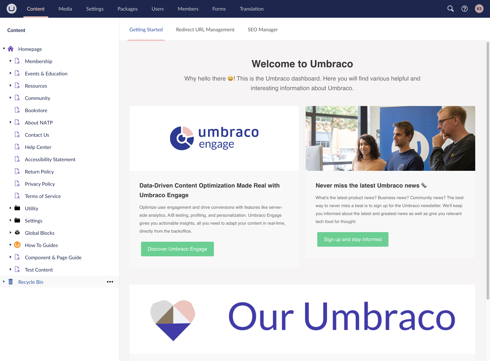

# Umbraco Basics

## How To Log In To Umbraco

1.  Navigate to your website domain name followed by **/umbraco/**
2.  Enter your **Email** and **Password**.
3.  Click **Login**.
    

## Navigating The Backoffice

### Content

The Content section contains content nodes that make up the website.

Nodes in Umbraco can display the following content states:
*   Grayed-out nodes are not published yet.
*   Nodes that are currently locked using the Public Access feature.
*   Content nodes that contain a collection of nodes.
    
### Media

The Media section contains the media for the website. You can create folders and upload media files, such as images and PDFs.

### Settings

The Settings section is where website layout files, content types, and other site-wide settings are managed by administrators.

### Packages

In this section, you can browse the different packages available for your Umbraco site. You can also get an overview of all the packages you have installed or created.

### Users

The Users section allows administrators to manage user accounts, assign permissions, set user roles, and monitor user activity within the backoffice. It provides control over who can access and modify content, media, and settings in the CMS.

### Members

The Members section allows you to create and manage member profiles, set up member groups, and control member's access to restricted content on the website (if applicable for your website).

### Translation

The Translation section is where various global labels throughout the site are managed.

<a href="https://docs.umbraco.com/umbraco-cms/13.latest/fundamentals/backoffice/sections" target="_blank">Read more about sections</a>
